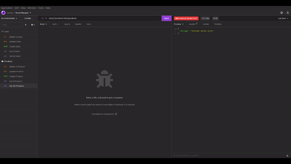

<h1 align="center">📦 Store Manager</h1>
<h3 align="center">Stock Management Database</h3>

  Store Manager is a stock database management from a fake store. I manipulated the data from MySql with Node.js and handled client's requests with the     proper response's status. The client is able to register, update, delete and consult his products and sales. I developed this project with API         RESTful, MSC layers and tests using Chai and Sinon. I also want to give credits to Trybe for giving StoreManager.sql and index.js files, thanks! 

  

<h3 align="left">Skills</h3>

- Make requests from an API
- Connect application with database
- Aply RESTful patterns
- Build application with MSC layers
- Mock and simulate tests

<h3 align="left">Connect with me</h3>

<h3 align="left">Languages and Tools</h3>

  
  
  
  
  
  
  
  
  

